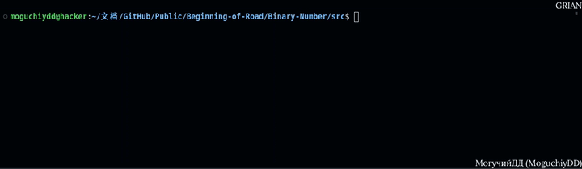

# 二进制
<div id="information" align="left">
  <a href="https://github.com/MoguchiyDD" target="_blank">
    
  </a>
  <a href="../LICENSE" target="_blank">
    
  </a>
  
</div>




## 函数
<table>
  <thead>
    <tr>
      <th>翻译</th>
      <th>功能说明</th>
      <th>命令行参数</th>
      <th>输入</th>
      <th>输出</th>
    </tr>
    </thead>
  <tbody>
    <tr>
      <td>2→8</td>
      <td>二进制化为八进制</td>
      <td>-bo</td>
      <td>0 … 1111111111111111111111111111111</td>
      <td>0 … +17777777777</td>
    </tr>
    <tr>
      <td>2→10</td>
      <td>二进制化为十进制</td>
      <td>-bd</td>
      <td>0 … 1111111111111111111111111111111</td>
      <td>0 … +2147483647</td>
    </tr>
    <tr>
      <td>2→16</td>
      <td>二进制化为十六进制</td>
      <td>-bh</td>
      <td>0 … 1111111111111111111111111111111</td>
      <td>0 … +7FFFFFFF</td>
    </tr>
    <tr>
      <td>8→2</td>
      <td>八进制化为二进制</td>
      <td>-ob</td>
      <td>0 … +17777777777</td>
      <td>0 … 1111111111111111111111111111111</td>
    </tr>
    <tr>
      <td>8→10</td>
      <td>八进制化为十进制</td>
      <td>-od</td>
      <td>0 … +17777777777</td>
      <td>0 … +2147483647</td>
    </tr>
    <tr>
      <td>8→16</td>
      <td>八进制化为十六进制</td>
      <td>-oh</td>
      <td>0 … +17777777777</td>
      <td>0 … +7FFFFFFF</td>
    </tr>
    <tr>
      <td>10→2</td>
      <td>十进制化为二进制</td>
      <td>-db</td>
      <td>0 … +2147483647</td>
      <td>0 … 1111111111111111111111111111111</td>
    </tr>
    <tr>
      <td>10→8</td>
      <td>十进制化为八进制</td>
      <td>-do</td>
      <td>0 … +2147483647</td>
      <td>0 … +17777777777</td>
    </tr>
    <tr>
      <td>10→16</td>
      <td>十进制化为十六进制</td>
      <td>-dh</td>
      <td>0 … +2147483647</td>
      <td>0 … +7FFFFFFF</td>
    </tr>
    <tr>
      <td>16→2</td>
      <td>十六进制化为二进制</td>
      <td>-hb</td>
      <td>0 … +7FFFFFFF</td>
      <td>0 … 1111111111111111111111111111111</td>
    </tr>
    <tr>
      <td>16→8</td>
      <td>十六进制化为八进制</td>
      <td>-ho</td>
      <td>0 … +7FFFFFFF</td>
      <td>0 … +17777777777</td>
    </tr>
    <tr>
      <td>16→10</td>
      <td>十六进制化为十进制</td>
      <td>-hd</td>
      <td>0 … +7FFFFFFF</td>
      <td>0 … +2147483647</td>
    </tr>
  </tbody>
</table>

## 启动项命令
```bash
$ make
$ ./bodh <命令行参数> <输入>
```
